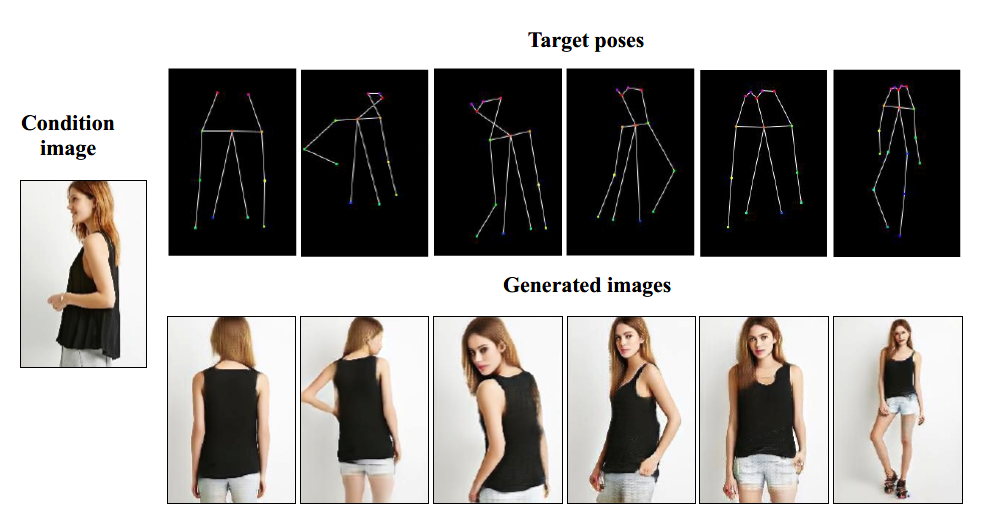
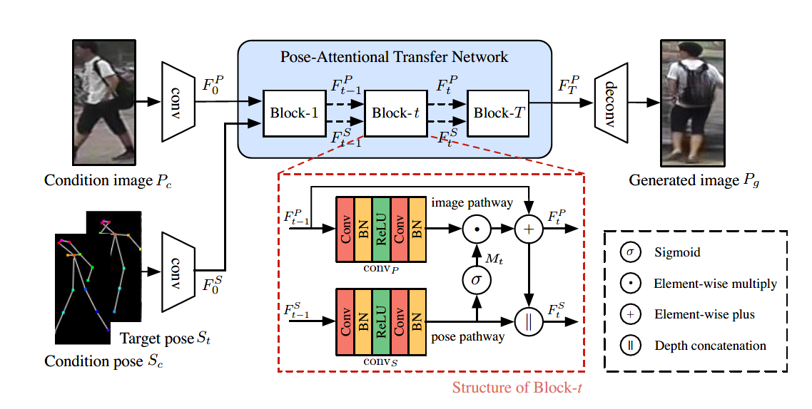

## 3D

## Progressive Pose Attention Transfer for Person Image Generation

\[[pdf](.\papers\Progressive Pose Attention Transfer for Person Image Generation.pdf)] \[[web](https://arxiv.org/pdf/1904.03349.pdf)] \[[code](https://github.com/tengteng95/Pose-Transfer)]

**What problem has this paper solved?**

Transfer the pose of a given person to a target pose

**What's new?**

A new generative adversarial network. **all the possible poses and views of a certain person constitute  a manifold. The structure of the manifold on the global level is complex, but simper on a local level.** *This insights motivates us to take a progressive pose transfer scheme.*

## RepNet: Weakly Supervised Training of an Adversarial Reprojection Network for 3D Human Pose Estimation

\[[pdf](./papers/RepNet Weakly Supervised Training of an Adversarial Reprojection Network.pdf)] \[[web](https://arxiv.org/pdf/1902.09868.pdf)]

## Dense Intrinsic Appearance Flow for Human Pose Transfer

\[[pdf](./papers/Dense Intrinsic Appearance Flow for Human Pose Transfer.pdf)] \[[web](https://arxiv.org/pdf/1903.11326.pdf)] \[[code](https://github.com/ly015/intrinsic_flow)]

# Fabric Retrieval

## [ICCV2017] Learning-based Cloth Material Recovery from Video

\[[pdf](./papers/Yang_Learning-Based_Cloth_Material_ICCV_2017_paper.pdf)] \[[web](http://openaccess.thecvf.com/content_ICCV_2017/papers/Yang_Learning-Based_Cloth_Material_ICCV_2017_paper.pdf)]

描述模型的材料模型的参数是软件的参数，[Wang](https://dl.acm.org/citation.cfm?id=1964966)

## [ICCV2015] Where to Buy It: Matching Street Clothing Photos in Online Shops 

 \[[pdf](./papers/Where to Buy It Matching Street Clothing Photos in Online Shops.pdf)] \[[web](https://www.cv-foundation.org/openaccess/content_iccv_2015/papers/Kiapour_Where_to_Buy_ICCV_2015_paper.pdf)]

query from a database, working on fashion dataset.

利用预训练的网络对图片提取高维特征**（不确定有没有微调，如果微调的话，具体微调的任务也没说明）**，用于后续的分类。

构造图片对，标签为匹配和未匹配。训练一个三层的全连接网络**（暴力）**。随后再对每个大类进行微调

## Learning Deep Similarity Models with Focus Ranking for Fabric Image Retrieval

\[[pdf](./papers/Learning Deep Similarity Models with Focus Ranking for Fabric Image Retrieval.pdf)] \[[web](https://arxiv.org/pdf/1712.10211.pdf)]

**创新点**：同时学习image representation和metric

## note

**通用做法**

- 使用一个descriptor把图片映射到特征空间

  

- 查询